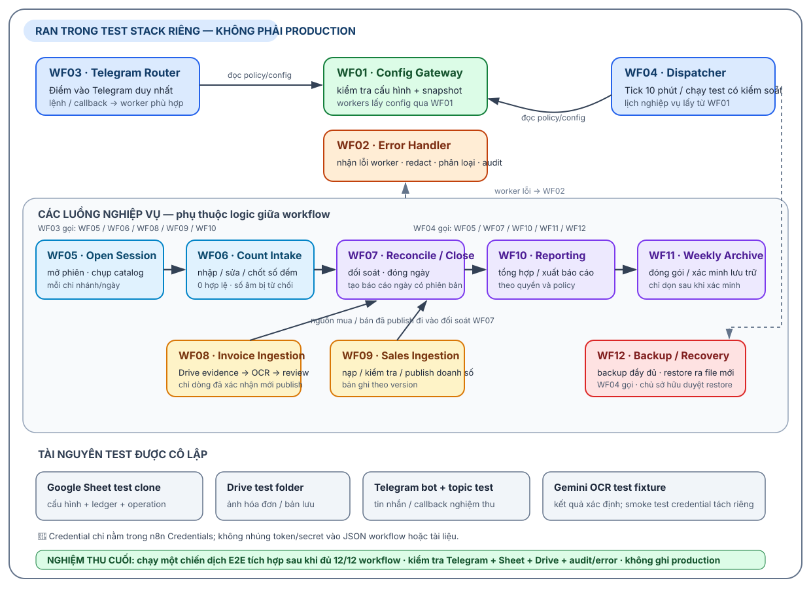

# Kiểm kê bia V2 — Blueprint thiết kế 12 workflow

> **Trạng thái:** thiết kế node-level; chưa phải implementation có thể chạy. Cả 12 JSON đi kèm vẫn `active=false`, còn node `Block Incomplete Workflow` và trạng thái `INCOMPLETE / BLOCKED_INCOMPLETE_IMPLEMENTATION`. Guard sẽ chặn execution trước xử lý nghiệp vụ. Không bind credential/ID thật, không import/activate vào hệ thống live và không coi smoke test trong gói là đã chạy.

Blueprint này cụ thể hóa trách nhiệm và hợp đồng trong [spec đã duyệt](../../superpowers/specs/2026-09-29-kiem-ke-bia-v2-deployment-design.md), theo header trong `DATA_DICTIONARY` do [schema manifest](../../../tools/kiem-ke-bia-v2/schema-manifest.mjs) định nghĩa. Sơ đồ dưới đây tóm tắt kiến trúc mục tiêu và luồng phụ thuộc; đây **không phải** bằng chứng các JSON hiện tại đã thực hiện được các luồng đó.

**Cách đọc:** đường liền là chuỗi/phụ thuộc nghiệp vụ; đường nét đứt là xử lý lỗi hoặc gọi theo lịch. WF03 là ingress Telegram duy nhất; WF04 là dispatcher với tick kỹ thuật 10 phút và lịch nghiệp vụ đọc từ WF01. Tất cả tài nguyên trong chiến dịch nghiệm thu phải thuộc môi trường test cô lập; không ghi vào production. Nghiệm thu người dùng diễn ra một lần theo bộ kịch bản tích hợp sau khi đủ 12/12 workflow; các kiểm tra từng phần trước đó chỉ là kiểm tra nội bộ.

## 1. Hợp đồng dùng chung

### Envelope và kết quả

Mỗi lệnh worker nhận envelope phiên bản `v2` gồm `request_id`, `operation_id`, `event_type`, `branch_id`, `actor_user_id`, `business_date`, `config_version`, `config_snapshot_id`, `payload` và `reply_target` phù hợp ngữ cảnh. Giá trị định danh được tạo ở runtime; không nhúng ID thật vào template. Kết quả thành công có `ok`, các ID liên quan, `status`, `data`, `warnings`. Kết quả lỗi có `ok=false`, `error_code`, `error_class`, `retryable`, `message_safe` và context workflow/node/operation/config đã được làm sạch.

### Config, commit và dữ liệu chuẩn

- Worker lấy cấu hình qua WF01; không tự đọc `CONFIG_*`. WF01 kiểm tra `CONFIG_SCHEMA`, trạng thái/effective date, tham chiếu, enum và maintenance/cutover phù hợp; trả snapshot bất biến có `config_version`, `config_snapshot_id` và fingerprint. Worker gắn snapshot đã dùng vào operation/record.
- Mỗi lần đọc một sheet trong một execution phải có một node đọc duy nhất lấy đủ hàng cần thiết; lọc theo branch/ngày ở xử lý sau khi đọc hoặc bằng range có giới hạn. Không đặt node Sheets read trong loop.
- Operation ghi nhiều sheet: reserve `OPERATION` ở `PREPARED`, ghi record nghiệp vụ có cùng `operation_id`, chỉ chuyển `COMMITTED` sau khi các bước ghi cần thiết thành công. Reader chỉ dùng record có operation commit tương ứng; lỗi giữa chừng không được lộ như dữ liệu đã xác nhận. Retry tiếp tục cùng idempotency key, không nhân đôi ledger.
- Ledger đã commit là append/versioned, không sửa trực tiếp. Sửa count/sales/report tạo record mới có quan hệ supersede; điều chỉnh tồn dùng `DIEU_CHINH_SO`.
- Ngày nghiệp vụ dùng timezone branch; timestamp kỹ thuật ISO-8601 UTC. `0` là số đếm hợp lệ; blank không phải zero; số âm bị từ chối trong kiểm kê.

### Lỗi và biên an toàn

Phân loại lỗi chuẩn: `VALIDATION`, `AUTHORIZATION`, `CONFLICT`, `TRANSIENT`, `CONFIGURATION`, `EXTERNAL`, `SYSTEM`, `MANUAL_REVIEW`. WF02 loại secret/raw private payload khỏi context, lưu thông tin an toàn và chỉ phát thông báo theo cấu hình. Không ghi token, credential, stack trace hay raw payload nhạy cảm vào reply/log. WF03 là Telegram Trigger duy nhất; WF04 chỉ dùng technical tick 10 phút, còn lịch nghiệp vụ/grace/retry/timezone đọc từ snapshot WF01. V2 tách biệt V1 và WF04 cũ.

## 2. Thiết kế từng workflow

Các bước bên dưới là **thứ tự node dự kiến khi implementation**; tên bước mô tả trách nhiệm, không tuyên bố JSON hiện tại đã có logic tương ứng. Tất cả luồng lỗi đều ghi nhận lỗi đã redact qua WF02 khi có thể; lỗi WF02 tự thân không gọi lại chính nó.

### WF01 — Config Gateway

- **Kích hoạt / input:** Execute Workflow; yêu cầu cấu hình có scope (global/branch), actor/request/operation, thời điểm nghiệp vụ và mục đích đọc.
- **Chuỗi node:** nhận và kiểm tra envelope → đọc `CONFIG_SCHEMA`, `CONFIG_VERSION` và các bảng cấu hình liên quan, mỗi sheet đúng một lần → kiểm tra header/schema, trạng thái, hiệu lực, enum, khóa/tham chiếu và quyền scope → canonicalize dữ liệu → fingerprint → reuse snapshot nếu fingerprint không đổi hoặc tạo version/snapshot mới → ghi operation/config records theo commit contract → trả snapshot đã chốt.
- **Đọc:** cấu hình chỉ qua WF01: `CONFIG_SCHEMA`, `CONFIG_VERSION`, `CONFIG_GLOBAL`, `CONFIG_BRANCH`, `CONFIG_TOPIC`, `CONFIG_LICH`, `CONFIG_USER`, `CONFIG_ROLE`, `CONFIG_PERMISSION`, `CONFIG_USER_ROLE`, `CONFIG_ROLE_PERMISSION`, `CONFIG_BIA`, `CONFIG_QUY_DOI`, `CONFIG_MAPPING_NHAP`, `CONFIG_NGUON_BAN`, `CONFIG_NGUON_BAN_COT`, `CONFIG_MAPPING_BAN`, `CONFIG_LENH`, `CONFIG_THONG_BAO`, `CONFIG_DRIVE`, `CONFIG_BACKUP`, `CONFIG_CUTOVER` (chỉ đọc sheet cần cho scope/yêu cầu; không bỏ kiểm tra schema chung).
- **Ghi:** `OPERATION`, `CONFIG_VERSION`, `CONFIG_SNAPSHOT`.
- **Commit / chống trùng:** operation ID của request; snapshot idempotency theo scope + fingerprint. Snapshot cũ bất biến; một lần gọi lại cùng fingerprint không tạo version nội dung mới.
- **Thành công / lỗi:** trả `config_version`, `config_snapshot_id`, fingerprint và dữ liệu cấu hình đã lọc. Header/schema/reference sai hoặc maintenance chặn worker an toàn; lỗi Sheets là `EXTERNAL`/`SYSTEM`; không phát snapshot “hợp lệ” một phần.
- **Phụ thuộc:** được WF02–WF12 gọi; là dịch vụ cấu hình dùng chung, không gọi worker nghiệp vụ.

### WF02 — Error Handler

- **Kích hoạt / input:** Error Workflow Trigger hoặc Execute Workflow; nhận lỗi cùng execution, workflow/node, operation/request và context tối thiểu.
- **Chuỗi node:** chuẩn hóa lỗi → redact token/credential/raw payload → phân loại và xác định retryability → lấy policy/template thông báo qua WF01 → tạo error id ổn định → append audit → gửi thông báo an toàn nếu policy cho phép/cooldown đã hết → trả kết quả xử lý lỗi.
- **Đọc:** cấu hình notification qua WF01; có thể đọc `ERROR_BIA` nếu cần dedupe theo error id.
- **Ghi:** `ERROR_BIA`, `EVENT_LOG`; cập nhật retry context chỉ theo quyết định của caller/dispatcher, không tự retry mọi lỗi.
- **Commit / chống trùng:** error id từ execution + operation + node + error code; cùng một lỗi được retry không tạo chuỗi cảnh báo trùng không giới hạn.
- **Thành công / lỗi:** trả `error_id`, `error_class`, `retryable`, `message_safe`; nếu ghi audit/thông báo lỗi thì giữ lỗi gốc, báo `SYSTEM` an toàn và không đệ quy gọi WF02.
- **Phụ thuộc:** WF01; được WF03/WF04 và error workflow n8n gọi.

### WF03 — Telegram Router

- **Kích hoạt / input:** Telegram Trigger duy nhất; nhận message/callback, chat/topic, user và mã update Telegram.
- **Chuỗi node:** normalize update → dựng `request_id`/idempotency key ổn định từ update/message/callback → gọi WF01 lấy user/role/permission/topic/command/config snapshot → kiểm tra branch/topic, hiệu lực và authorization → tra replay hoặc reserve `OPERATION` → route command đã cấu hình tới WF05/WF06/WF08/WF09/WF10 → chuẩn hóa kết quả → dựng reply an toàn và gửi Telegram → append event/hoàn tất operation.
- **Đọc:** cấu hình qua WF01; `OPERATION` để dedupe/reserve và `STATE_CHO` khi command cần ngữ cảnh hội thoại.
- **Ghi:** `OPERATION`, `EVENT_LOG`; worker sở hữu các ghi nghiệp vụ và `STATE_CHO` tương ứng. Ghi `RETRY_CONTEXT` khi có retry có kiểm soát.
- **Commit / chống trùng:** Telegram update id kết hợp bot/event scope; replay trả kết quả operation trước, không chạy worker lần hai.
- **Thành công / lỗi:** trả/gửi `message_safe` và operation id. Sai quyền/topic không gọi worker; command không rõ hướng dẫn an toàn; timeout/transient dùng cùng key và có giới hạn retry; lỗi worker đi WF02.
- **Phụ thuộc:** WF01, WF02, WF05, WF06, WF08, WF09, WF10.

### WF04 — Dispatcher

- **Kích hoạt / input:** Schedule Trigger technical tick 10 phút; Execute Workflow cho kiểm tra có kiểm soát. Lịch nghiệp vụ lấy từ WF01, không hard-code vào cron.
- **Chuỗi node:** gọi WF01 → tính due occurrence theo timezone/grace/effective dates của snapshot → đọc `DISPATCH_HISTORY` và `HEARTBEAT` mỗi sheet một lần → bỏ qua key đã claim/hoàn tất, xác định retry/recovery đủ điều kiện → claim dispatch key trước khi gọi worker → gọi worker theo cấu hình → ghi heartbeat/kết quả và retry context nếu cần → trả tổng hợp lượt chạy.
- **Đọc:** config schedule qua WF01; `DISPATCH_HISTORY`, `HEARTBEAT`, `OPERATION`/`RETRY_CONTEXT` khi recovery yêu cầu.
- **Ghi:** `DISPATCH_HISTORY`, `HEARTBEAT`, `RETRY_CONTEXT`, `OPERATION`.
- **Commit / chống trùng:** dispatch key = schedule + branch + scheduled local occurrence. Claim phải bền vững trước worker; lease/attempt theo policy cấu hình; retry giữ operation/idempotency context.
- **Thành công / lỗi:** báo due/claimed/skipped/completed. Lỗi claim là conflict và không gọi worker; lỗi worker được phân loại qua WF02; heartbeat stale chỉ kích hoạt recovery theo ngưỡng cấu hình, không tạo dispatch mới tùy tiện.
- **Phụ thuộc:** WF01, WF02, WF05, WF07, WF10, WF11, WF12.

### WF05 — Open Session

- **Kích hoạt / input:** Execute Workflow từ WF03/WF04; branch, business date, actor, topic và request/idempotency.
- **Chuỗi node:** validate envelope → gọi WF01 → đọc session của branch/ngày và state liên quan → xác nhận không tồn tại session `ACTIVE_SESSION` còn hạn khác → chụp catalog/config và TTL vào session snapshot → reserve operation → tạo session và `STATE_CHO` với cùng `expires_at` UTC → commit → trả session id, revision ban đầu và danh mục.
- **Đọc:** `PHIEN_KIEM_KE`, `STATE_CHO`; catalog/config qua WF01.
- **Ghi:** `OPERATION`, `PHIEN_KIEM_KE`, `STATE_CHO`, `EVENT_LOG`.
- **Tuần tự hóa / TTL:** không tạo khóa giả bằng Google Sheets. Nghiệm thu mở phiên đồng thời chỉ đi qua production triggers WF03/WF04 đang chờ worker và self-hosted n8n test có `N8N_CONCURRENCY_PRODUCTION_LIMIT=1` cùng `EXECUTIONS_TIMEOUT` hữu hạn. Cơ chế này tuần tự hóa toàn bộ production executions, không chỉ theo branch; chạy WF05 thủ công hoặc gọi trực tiếp nằm ngoài bảo đảm. `CONFIG_GLOBAL.inventory_session_ttl_minutes` phải là số nguyên dương trong snapshot WF01; thiếu/sai thì chặn mở phiên. Hết hạn không xóa lịch sử và không chặn phiên mới.
- **Commit / chống trùng:** idempotency theo yêu cầu mở phiên; kiểm tra phiên còn hạn trong WF05 được bảo vệ bởi cổng single-flight ở môi trường test, rồi ghi theo journal PREPARED/COMMITTED.
- **Thành công / lỗi:** trả session/config snapshot/revision. Session chưa hết hạn đã tồn tại là `CONFLICT`; config/catalog/TTL lỗi là `CONFIGURATION`; lỗi ghi dở không trả session như đã mở.
- **Phụ thuộc:** WF01; được WF03/WF04 gọi; mở đường cho WF06.

### WF06 — Count Intake

- **Kích hoạt / input:** Execute Workflow; session id, item/count, actor, expected revision, hành động save/preview/finalize và idempotency key.
- **Chuỗi node:** gọi WF01 và lấy session snapshot đúng version → đọc `PHIEN_KIEM_KE`, `BIA_LOG`, state một lần mỗi sheet → xác minh session còn hạn (`expires_at > now`), quyền, item trong snapshot và revision → validate count (`0` hợp lệ; blank/âm/NaN bị từ chối) → tạo preview hoặc version count mới → khi finalize, optimistic revision check lần cuối → ghi `BIA_LOG` và cập nhật state/session → commit → nếu finalize ngày thì gọi WF07.
- **Đọc:** `PHIEN_KIEM_KE`, `BIA_LOG`, `STATE_CHO`; danh mục qua WF01/session snapshot.
- **Ghi:** `OPERATION`, append/version `BIA_LOG` với supersede link, cập nhật `STATE_CHO`/revision, audit event.
- **Commit / chống trùng:** session + item + expected revision + client request; sửa count tạo version mới, không sửa ledger đã commit.
- **Thành công / lỗi:** preview/finalize trả revision mới và trạng thái còn thiếu. Revision cũ/session hết hạn là `CONFLICT`; blank/âm là `VALIDATION`; không finalize nếu count chưa hoàn tất hoặc còn lỗi.
- **Phụ thuộc:** WF01, WF07; được WF03 gọi và WF05 mở session trước đó.

### WF07 — Reconcile / Close

- **Kích hoạt / input:** Execute Workflow từ finalize, dispatcher hoặc lệnh đóng ngày; branch/ngày/session/config snapshot.
- **Chuỗi node:** gọi WF01 → đọc opening balance, purchase/sales ledger đã commit, adjustments đã duyệt, count cuối và trạng thái intake/pending → kiểm tra đã thông báo và không còn nguồn dữ liệu đang chờ trước khi coi purchase/sales thiếu là zero → tính canonical theoretical quantity = opening + confirmed purchases − active/published sales + approved adjustments → so với actual count → yêu cầu explanation cho variance theo ngưỡng config → tạo version report ngày → commit/đóng ngày → trả ngoại lệ và phiên bản.
- **Đọc:** `TON_DAU_KY`, `LOG_NHAP`, `LOG_BAN`, `DIEU_CHINH_SO`, `BIA_LOG`, `HOA_DON_NHAP`, `DOT_NHAP_BAN`, `OPERATION` khi kiểm tra pending; tất cả reader lọc record committed/approved/published.
- **Ghi:** `OPERATION`, append `BAO_CAO_NGAY`, `EVENT_LOG`; notification qua WF02/policy WF01 khi cần.
- **Commit / chống trùng:** branch + business date + finalized count revision + fingerprint các source version. Báo cáo mới supersede report trước; không sửa ledger.
- **Thành công / lỗi:** trả report version và variance. Intake pending thì giữ ngày chưa đóng; thiếu explanation hoặc snapshot/source mâu thuẫn là validation/conflict/manual review; không ngầm đổi missing thành zero trước notify và pending check.
- **Phụ thuộc:** WF01; nguồn dữ liệu từ WF05/WF06/WF08/WF09; gọi bởi WF03/WF04; đầu ra cho WF10/WF11.

### WF08 — Invoice Ingestion

- **Kích hoạt / input:** Execute Workflow từ Telegram route; ảnh/file hoặc album, sender, branch/topic, `first_received_at`, invoice/action/revision.
- **Chuỗi node:** normalize/group album và checksum-dedupe → gọi WF01 lấy item/conversion/mapping/Drive policy → reserve invoice operation → lưu bằng chứng vào Drive trước OCR → append `ANH_HOA_DON` và cập nhật `HOA_DON_NHAP` → chỉ khi có hành động OCR rõ ràng mới gọi Gemini → lưu sanitized/raw OCR theo policy và chuẩn hóa dòng vào `DONG_NHAP` → yêu cầu người dùng review/mapping/đơn vị/supplier → chỉ line `CONFIRMED` được publish vào `LOG_NHAP` → commit và trả summary.
- **Đọc:** cấu hình qua WF01; `HOA_DON_NHAP`, `ANH_HOA_DON`, `OCR_RAW`, `DONG_NHAP`, `LOG_NHAP` để resume/dedupe/revision.
- **Ghi:** Drive evidence; `OPERATION`, `HOA_DON_NHAP`, append `ANH_HOA_DON`, `OCR_RAW`, `DONG_NHAP`; confirmed lines mới tạo `LOG_NHAP`.
- **Commit / chống trùng:** Telegram media/file checksum + invoice/album identity + revision/action; Drive upload retry tra checksum/file mapping trước để tránh bản evidence trùng. Ngày hóa đơn dùng ngày local lúc Telegram nhận lần đầu.
- **Thành công / lỗi:** trả invoice id, evidence count, OCR/review status. Drive lỗi thì không OCR; Gemini lỗi chuyển manual review có kiểm soát; supplier có thể lưu text hoặc `NHÀ CUNG CẤP KHÔNG RÕ`; line chưa confirm không vào ledger.
- **Phụ thuộc:** WF01, Drive, Gemini OCR; đóng ngày qua WF07 sau publish.

### WF09 — Sales Ingestion

- **Kích hoạt / input:** Execute Workflow từ Telegram/dispatcher; branch, file/source, uploader, business period, preview/publish request và approver khi policy yêu cầu.
- **Chuỗi node:** gọi WF01 lấy source/column/header alias/mapping/conversion → đọc file từ Drive và tính file hash → reuse file trùng hash hoặc parse/normalize → mapping và chuyển đơn vị → lưu batch/source rows → dựng preview và lỗi theo từng dòng → yêu cầu sửa/duyệt nếu cần → publish versioned `LOG_BAN` → commit.
- **Đọc:** config qua WF01; `DOT_NHAP_BAN`, `DONG_BAN_NGUON`, `LOG_BAN` để dedupe/version.
- **Ghi:** `OPERATION`, `DOT_NHAP_BAN`, append `DONG_BAN_NGUON`, append/version `LOG_BAN`, `EVENT_LOG`.
- **Commit / chống trùng:** source file hash và normalized-content hash. Hash file trùng được reuse; normalized-content no-op không tạo version mới. Thay file thật có supersede relation; sales âm đi qua adjustment.
- **Thành công / lỗi:** trả batch id, mapping/preview summary và published version. Mapping/file lỗi đặt `CHO_SUA_FILE` và chặn `SYSTEM_ZERO`; `SYSTEM_ZERO` chỉ sau notification và xác nhận không còn file/pending operation theo policy.
- **Phụ thuộc:** WF01, Drive; WF03/WF04 gọi; publish là input của WF07.

### WF10 — Reporting

- **Kích hoạt / input:** Execute Workflow từ lệnh hoặc dispatcher; branch, kỳ tuần, report/source version.
- **Chuỗi node:** gọi WF01 lấy lịch/locale/report policy → đọc các `BAO_CAO_NGAY` đã commit cho kỳ và nguồn ledger cần đối soát → kiểm tra kỳ đầy đủ/ngoại lệ → tổng hợp theo item/branch → tạo phiên bản `BAO_CAO_TUAN` → commit → trả report id/tóm tắt.
- **Đọc:** `BAO_CAO_NGAY` cùng `LOG_NHAP`/`LOG_BAN` chỉ khi cần đối chiếu; chỉ dữ liệu đã commit.
- **Ghi:** `OPERATION`, append/version `BAO_CAO_TUAN`, `EVENT_LOG`.
- **Commit / chống trùng:** branch + week range + max daily report version/source fingerprint. Tạo lại cùng nguồn là no-op hoặc cùng report version; source mới tạo version superseding.
- **Thành công / lỗi:** trả report tuần/exception count. Ngày chưa đóng hoặc report thiếu được đánh dấu pending, không tổng hợp lặng lẽ; không ghi/sửa canonical ledger.
- **Phụ thuộc:** WF01 và WF07; được WF03/WF04 gọi; cung cấp số liệu cho WF11.

### WF11 — Weekly Archive

- **Kích hoạt / input:** Execute Workflow từ dispatcher/manual authorized request; branch, tuần, retention/effective policy.
- **Chuỗi node:** gọi WF01 lấy Drive/archive/retention policy → kiểm tra eligibility và không có operation PREPARED liên quan → đọc các report/ledger/event cần archive → dựng archive workbook và manifest gồm sheet/row counts, keys, date bounds, schema/content hashes → ghi file Drive → đọc lại/verify manifest và hash → ghi `ARCHIVE_INDEX` → chỉ sau verify thành công và hết thời gian giữ nguồn mới purge theo batch an toàn → lưu kết quả.
- **Đọc:** `BAO_CAO_NGAY`, `LOG_NHAP`, `LOG_BAN`, `BIA_LOG`, `EVENT_LOG`, `OPERATION` khi kiểm tra commit/pending; config qua WF01.
- **Ghi:** archive workbook trên Drive; `OPERATION`, `ARCHIVE_INDEX`; purge chỉ những record đã archive/verify và eligible, không chỉnh sửa record còn giữ.
- **Commit / chống trùng:** branch + week range + source workbook + source fingerprint. Tuần rỗng chỉ hoàn tất với `EMPTY_VERIFIED`; không purge trước verify.
- **Thành công / lỗi:** trả archive id, manifest hash, counts và purge status. Thiếu row/hash/key, file không đọc lại được hoặc có operation PREPARED thì giữ nguyên nguồn, không purge; route lỗi WF02.
- **Phụ thuộc:** WF01, WF07, WF10, Drive; được WF04/manual authorized request gọi.

### WF12 — Backup / Recovery

- **Kích hoạt / input:** Execute Workflow từ dispatcher/manual owner action; backup hoặc restore, source workbook, policy/config snapshot, approval context.
- **Chuỗi node:** gọi WF01 → kiểm tra CONFIG_SCHEMA và OPERATION, bỏ qua backup nếu policy quy định và đang có PREPARED → tạo bản copy toàn workbook → tính schema hash/row counts/content fingerprint → verify backup đọc lại ở chế độ chỉ đọc → append `BACKUP_INDEX` → áp retention từ config → với restore, tạo workbook mới (không overwrite source), restore rồi verify → chờ owner approve riêng trước khi switch nguồn.
- **Đọc:** `CONFIG_SCHEMA`, `OPERATION`, `ERROR_BIA`, `BACKUP_INDEX`; cấu hình retention/Drive qua WF01.
- **Ghi:** file backup/restore mới trên Drive; `OPERATION`, `BACKUP_INDEX`. Không ghi đè workbook nguồn.
- **Commit / chống trùng:** source workbook + snapshot/fingerprint + backup occurrence; restore idempotency theo backup id + restore request. Giữ retention theo config (mặc định 14 trong spec, không hard-code vào workflow).
- **Thành công / lỗi:** trả backup id, verify hashes/counts, retention/restore status. Verify lệch thì không đánh dấu backup tốt; restore không switch nguồn khi chưa owner approval; file nguồn cũ luôn được giữ.
- **Phụ thuộc:** WF01, Drive; được WF04/owner gọi; không sửa hay nhập dữ liệu ngược vào V1.

## 3. Dependency và trình tự import dự kiến

Dependency nghiệp vụ: `WF05 → WF06 → WF07 → WF10 → WF11`; WF08 và WF09 đưa dữ liệu vào WF07; WF03 là ingress tương tác; WF04 là dispatcher/recovery. WF02 xử lý lỗi an toàn; WF01 cung cấp cấu hình cho mọi worker. WF12 backup/restore chạy độc lập theo lịch/policy.

Thứ tự import sau khi implementation hoàn tất vẫn theo spec: `WF02, WF01, WF05, WF06, WF08, WF09, WF07, WF10, WF11, WF12, WF03, WF04`. Thứ tự import không đồng nghĩa với thứ tự activate.

## 4. Giới hạn của bộ artifact này

Blueprint là thiết kế mục tiêu; các JSON cùng ZIP hiện chỉ là scaffold có guard chặn chạy. Một số node đọc config trực tiếp hoặc boundary node trong scaffold cần được chỉnh theo hợp đồng trên trong giai đoạn implementation; vì vậy không dùng riêng blueprint để gỡ guard hay activate. Workbook `.xlsx` chỉ là template/snapshot 50 tab; Google Sheet live vẫn là nguồn cấu hình nghiệp vụ có thẩm quyền. Hướng dẫn setup, checklist và smoke matrix là điều kiện triển khai/kiểm thử tương lai, không phải bằng chứng đã kết nối hay nghiệm thu.
