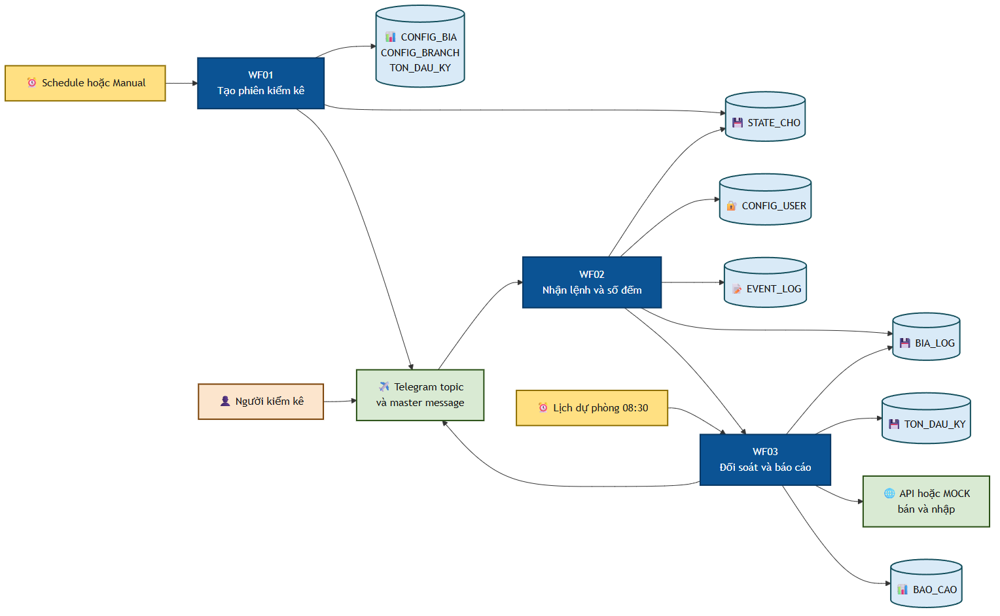
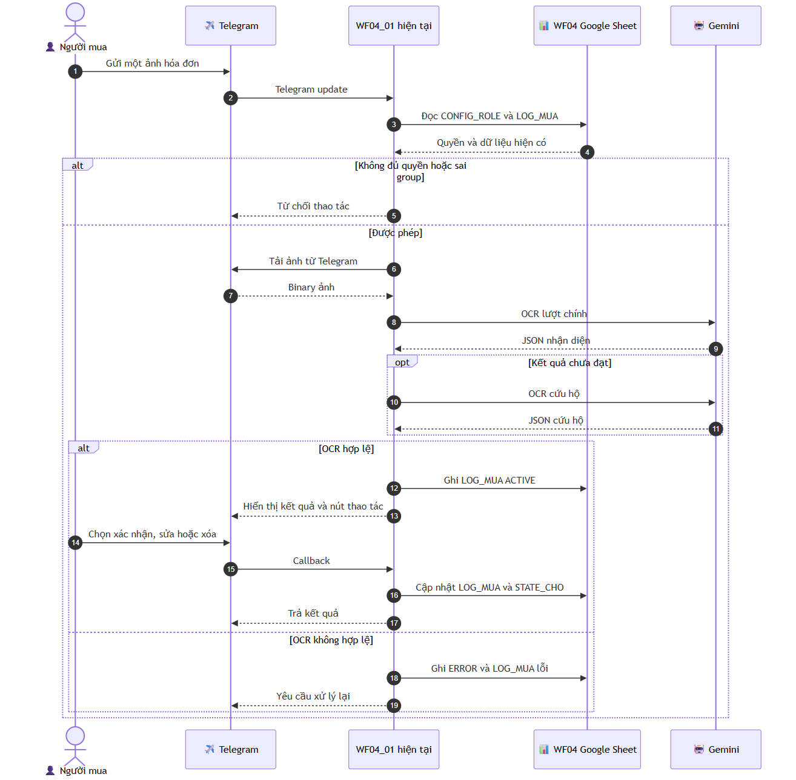

# 02 — Hiện trạng hệ thống

## Tổng quan Kiểm kê bia V1

Hệ hiện tại chia trách nhiệm thành ba workflow nhưng còn dùng chung trạng thái và cấu hình được nhúng trong Code node. Google Sheets vừa là kho cấu hình vừa là sổ vận hành. Telegram là giao diện chính.

[Nguồn Mermaid](./diagrams/current-beer-flow.mmd)

### WF01 — Lịch và mở phiên

- Kích hoạt bằng lịch 08:00, manual hoặc lời gọi subworkflow.
- Đọc `CONFIG_BRANCH`, `CONFIG_BIA`, `TON_DAU_KY`.
- Tạo snapshot danh mục bia cho phiên.
- Tạo hoặc tái sử dụng topic Telegram theo chi nhánh.
- Ghi trạng thái phiên vào `STATE_CHO` và sự kiện vào `EVENT_LOG`.
- TTL mặc định hiện nằm trong Code node.

### WF02 — Telegram và số đếm

- Nhận mọi Telegram update từ bot kiểm kê.
- Chống xử lý trùng bằng `EVENT_LOG`.
- Đọc `CONFIG_USER`, `STATE_CHO`, `BIA_LOG`, `BAO_CAO`.
- Xử lý `/help`, `/kiembia`, callback và nhập số lượng.
- Kiểm tra dữ liệu rồi ghi `BIA_LOG`.
- Gọi WF03 để tổng hợp/đối soát.

### WF03 — Đối soát và báo cáo

- Chạy qua schedule 08:30, manual hoặc execute-subworkflow.
- Đọc trạng thái, số đếm, danh mục bia và tồn đầu.
- Nhận bán/nhập từ API hoặc bảng mock theo `api_mode` hiện tại.
- Tính tồn lý thuyết, chênh lệch, mức cảnh báo.
- Ghi `BAO_CAO`, cập nhật `STATE_CHO`, ghi `EVENT_LOG` và gửi Telegram.

## WF04 — Chỉ dùng làm mẫu tham khảo

WF04 thể hiện nhiều mẫu hành vi hữu ích nhưng chứa cả nghiệp vụ quỹ, công nợ và kho lạnh. V2 không phụ thuộc hay gọi WF04.

| Workflow | Mẫu được tham khảo | Không được sao chép nguyên trạng |
|---|---|---|
| WF04_01 | Router Telegram, album ảnh, OCR Gemini, preview/callback, luồng lỗi | Schema quỹ/công nợ, group ID, token/API key, Code node lớn |
| WF04_02 | Báo cáo theo lịch và cảnh báo | Logic tính quỹ, ngưỡng nhúng trong code |
| WF04_03 | Phát hiện ngày không phát sinh và gửi thông báo | Lịch/đích gửi hard-code |
| WF04_04 | Cleanup trạng thái theo TTL | Chu kỳ 5 phút và schema `STATE_CHO` cũ |

[Nguồn Mermaid](./diagrams/current-wf04-ocr-sequence.mmd)

## Các điểm cấu hình đang nhúng trong n8n

| Workflow / node | Nhóm giá trị hiện có | Hướng xử lý V2 |
|---|---|---|
| WF01 / `CONFIG - PASTE VALUES` | Spreadsheet ID, bot token, TTL 240, timezone, tên sheet | Chỉ giữ bootstrap kỹ thuật cần thiết; tải cấu hình nghiệp vụ qua Config Gateway |
| WF02 / `Normalize Update & CONFIG` | Spreadsheet ID, tên sheet, bot token, trạng thái, timeout | Chuyển trạng thái/timeout/quyền sang sheet config |
| WF03 / `Normalize Input & CONFIG` | Spreadsheet ID, tên sheet, API mode, bot token, URL/token API, quy tắc thiếu dữ liệu | Chuyển mode, nguồn, lịch, chính sách thiếu dữ liệu sang sheet config |
| WF04_01 | Spreadsheet ID, Telegram group/topic, ngưỡng, timezone, expiry, Gemini key trong HTTP node | Chỉ tham khảo hành vi; V2 dùng credential n8n và cấu hình sheet |

Không thay đổi các vị trí này trong nguồn V1 ở giai đoạn hiện tại. Khi triển khai V2, không được sao chép giá trị bí mật sang Google Sheets; credential kỹ thuật vẫn do n8n quản lý, còn cấu hình nghiệp vụ nằm trong sheet.

## Khoảng trống cần V2 giải quyết

- Không có một cửa ngõ cấu hình có kiểm tra schema/version và cache nhất quán.
- Router Telegram và logic nghiệp vụ gắn quá chặt trong workflow lớn.
- Role hiện là một cột đơn trong `CONFIG_USER`; chưa hỗ trợ nhiều role/quyền theo chi nhánh.
- Log, trạng thái và ledger chưa có cơ chế rotate/backup/restore thống nhất.
- Bản gốc ảnh hóa đơn chưa có chính sách lưu bằng chứng độc lập và tra cứu lâu dài.
- Ghi nhiều sheet chưa có trạng thái `PREPARED → COMMITTED/FAILED` để phục hồi.
- Chưa có version rõ ràng cho dữ liệu bán, chốt tồn và điều chỉnh sau khóa sổ.
- Cấu hình nghiệp vụ hiện có thể bị phân tán giữa Code node và các sheet.
- `/help` V1 chưa phải danh mục lệnh/cú pháp/mô tả đầy đủ theo cấu hình V2.

## Ranh giới bảo trì V1 trong lúc xây V2

- Chỉ sửa V1 khi có lỗi vận hành thực tế cần khắc phục.
- Không đưa tính năng V2 mới vào WF04.
- Không đổi credential hoặc ID nguồn chỉ để đồng bộ tên gọi.
- Mọi thay đổi V1 phải có ghi chú hồi quy vì V2 sẽ chạy song song trước cutover.
- V2 dùng sheet/state riêng để có thể rollback về V1 mà không đảo dữ liệu.
