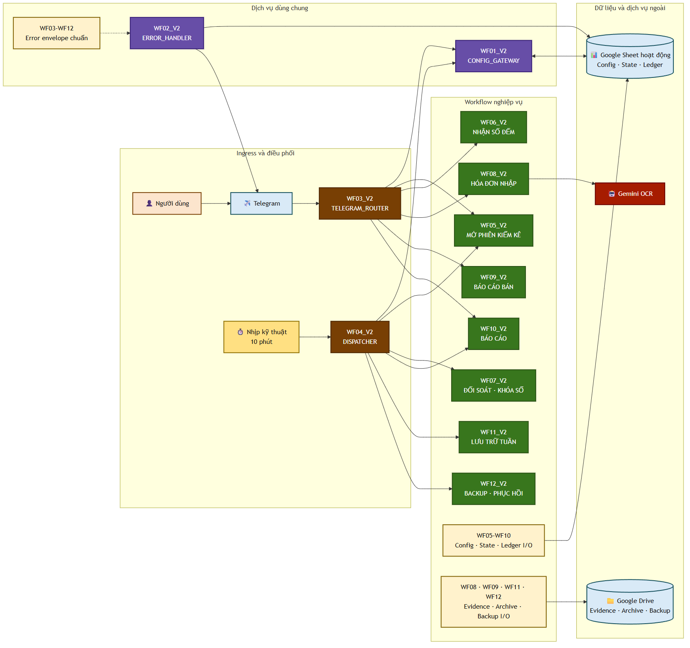
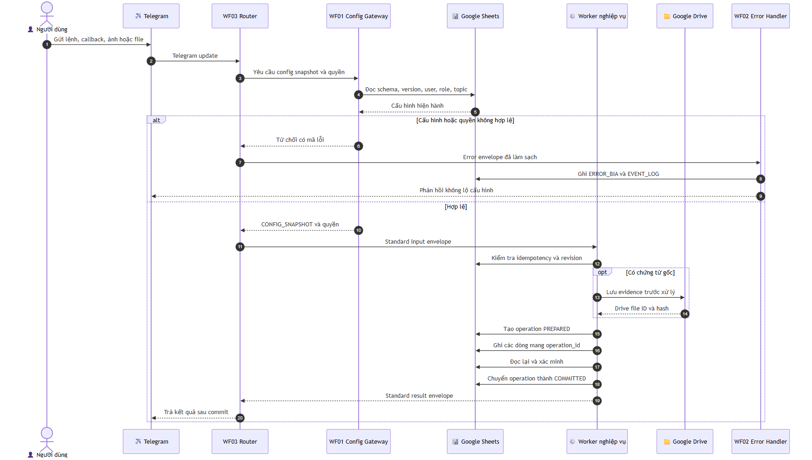
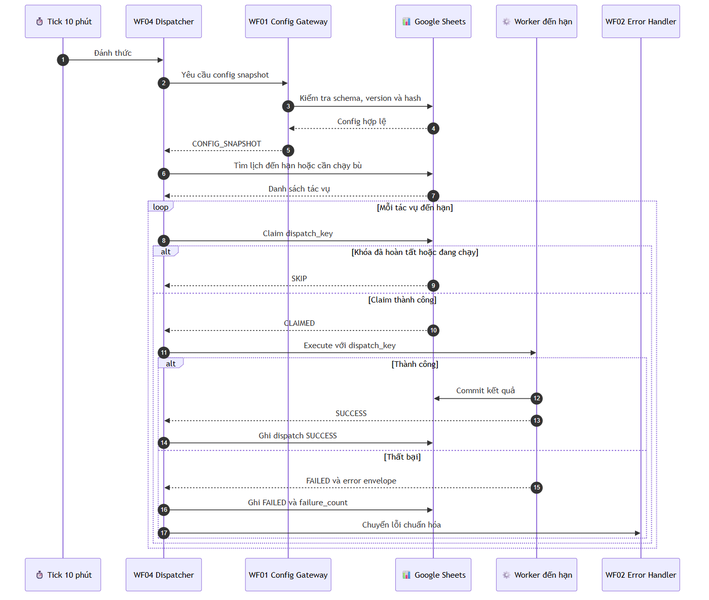
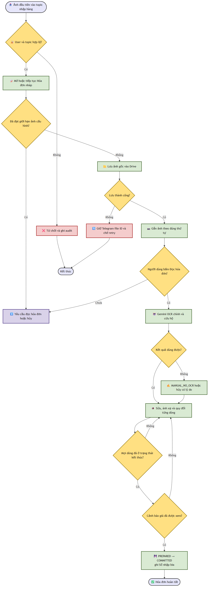
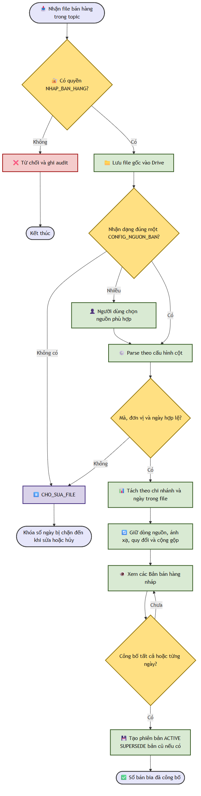
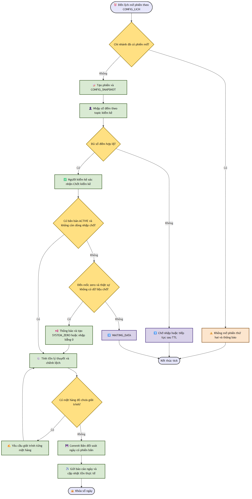
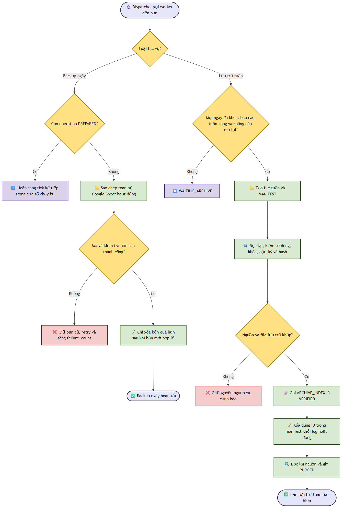

# 04 — Thiết kế đích Kiểm kê bia V2

## Quyết định nền

Phương án A đã được duyệt: V2 gồm 12 workflow nhỏ, một Telegram Router duy nhất, một Dispatcher đọc lịch từ Google Sheets mỗi 10 phút và một Config Gateway duy nhất. V2 dùng sheet/state riêng, chạy song song với V1 trong giai đoạn xác nhận và có công tắc cutover/rollback.



[Nguồn Mermaid](./diagrams/v2-architecture.mmd)

## Danh mục 12 workflow

| Thứ tự import | Tên workflow đề xuất | Trách nhiệm | Trigger chính |
|---:|---|---|---|
| 1 | `WF01_V2_CONFIG_GATEWAY` | Đọc, kiểm tra, cache cấu hình và trả snapshot/version | Execute Workflow Trigger |
| 2 | `WF02_V2_ERROR_HANDLER` | Chuẩn hóa lỗi, ghi log, retry/notify nhóm lỗi | Error Trigger + execute |
| 3 | `WF05_V2_MO_PHIEN_KIEM_KE` | Mở/reuse topic đếm tồn và tạo snapshot phiên | Execute Workflow Trigger |
| 4 | `WF06_V2_NHAN_SO_DEM` | Nhận/kiểm tra số đếm, preview và chốt phiên | Execute Workflow Trigger |
| 5 | `WF07_V2_DOI_SOAT_KHOA_SO` | Khóa dữ liệu ngày, đối soát và xuất báo cáo | Execute Workflow Trigger |
| 6 | `WF08_V2_HOA_DON_NHAP` | Gom 5–10 ảnh, lưu bằng chứng, OCR, review và ghi nhập | Execute Workflow Trigger |
| 7 | `WF09_V2_BAO_CAO_BAN` | Nhận file, mapping, preview, version và publish bán | Execute Workflow Trigger |
| 8 | `WF10_V2_BAO_CAO` | Lệnh và job báo cáo ngày/tuần | Execute Workflow Trigger |
| 9 | `WF11_V2_LUU_TRU_TUAN` | Backup log theo tuần, folder tháng, xác minh rồi dọn sheet gốc | Execute Workflow Trigger |
| 10 | `WF12_V2_BACKUP_PHUC_HOI` | Backup phục hồi hằng ngày, manifest và kiểm tra restore | Execute Workflow Trigger |
| 11 | `WF03_V2_TELEGRAM_ROUTER` | Nhận update duy nhất, phân quyền và định tuyến | Telegram Trigger |
| 12 | `WF04_V2_DISPATCHER` | Mỗi 10 phút đọc lịch/config rồi gọi job đến hạn | Schedule Trigger |

Workflow ID thực được điền sau import. Mọi lời gọi subworkflow phải được nối lại và kiểm tra theo checklist triển khai. Router và Dispatcher chỉ được active sau khi các worker đã import, liên kết và smoke test.

## Hợp đồng gọi workflow

Mọi subworkflow nhận một envelope chuẩn:

```json
{
  "request_id": "immutable-id",
  "operation_id": "immutable-id",
  "event_type": "TELEGRAM_UPDATE|SCHEDULED_JOB|MANUAL_RETRY",
  "branch_id": "branch-code",
  "actor_user_id": "telegram-user-id-or-system",
  "business_date": "YYYY-MM-DD",
  "config_version": "version-id",
  "payload": {}
}
```

Kết quả chuẩn:

```json
{
  "ok": true,
  "request_id": "immutable-id",
  "operation_id": "immutable-id",
  "status": "COMMITTED",
  "data": {},
  "warnings": []
}
```

Lỗi chuẩn tối thiểu gồm `error_code`, `error_class`, `retryable`, `message_safe`, `workflow`, `node`, `operation_id`, `config_version` và con trỏ tới bằng chứng/log. Không ghi secret vào error payload.

## Giao dịch nhiều sheet

Các thao tác ghi nhiều ledger dùng trạng thái:

```text
PREPARED → COMMITTED
         ↘ FAILED → RETRYING → COMMITTED | MANUAL_REVIEW
```

- Tạo `operation_id` bất biến trước khi ghi.
- Ghi operation `PREPARED` cùng số dòng dự kiến và checksum.
- Ghi các ledger theo idempotency key.
- Xác minh đủ số dòng/checksum rồi chuyển `COMMITTED`.
- Nếu lỗi, không che giấu phần đã ghi; đánh dấu `FAILED` để job retry hoặc người vận hành xử lý.

## Telegram Router và topic



[Nguồn Mermaid](./diagrams/v2-telegram-sequence.mmd)

Các topic nghiệp vụ tách riêng tối thiểu:

- Nhập hóa đơn.
- Nhập báo cáo bán hàng.
- Đếm tồn.
- Báo cáo/thông báo.
- Lỗi vận hành, nếu cấu hình gửi về Telegram group lỗi.

`/help` phải đọc command catalog từ Google Sheets và hiển thị đầy đủ tên lệnh, cú pháp, mô tả, quyền cần có và ví dụ. Nội dung không hard-code trong Router.

## Dispatcher 10 phút



[Nguồn Mermaid](./diagrams/v2-dispatcher-sequence.mmd)

- Trigger kỹ thuật cố định mỗi 10 phút chỉ có nhiệm vụ đánh thức Dispatcher.
- Lịch nghiệp vụ, timezone, cửa sổ chạy, độ trễ cho phép, enable/disable và retry policy nằm trong sheet config.
- `DISPATCH_HISTORY` và idempotency key ngăn cùng job chạy hai lần trong một cửa sổ.
- Khi Dispatcher trễ, nó chạy bù các job còn trong grace window; ngoài cửa sổ thì cảnh báo thay vì tự chạy sai ngày.

## Hoạt động nhập hóa đơn



[Nguồn Mermaid](./diagrams/v2-purchase-activity.mmd)

Quy tắc chính:

- Gom album/nhiều ảnh theo nhóm; giới hạn tối đa nằm trong Google Sheets và phải trong khoảng 5–10 ảnh.
- Ảnh gốc được lưu Google Drive trước khi OCR; ledger giữ file ID/URL và checksum.
- Chỉ dùng Gemini cho OCR; key nằm trong credential n8n, không trong sheet hay Code node.
- Ngày nghiệp vụ nhập = ngày upload ảnh lên Telegram theo timezone chi nhánh.
- Hóa đơn thuộc đúng một chi nhánh.
- Không quản lý master nhà cung cấp; chỉ lưu tên nhận diện, mặc định `Nhà cung cấp không rõ`.
- Nghi trùng chỉ là cảnh báo. Khi người dùng xác nhận, ghi như một hóa đơn mới với ID mới.
- Dòng nhận dạng được phép sửa/loại bỏ/thêm trước khi người có quyền xác nhận.

## Hoạt động nhập bán hàng



[Nguồn Mermaid](./diagrams/v2-sales-activity.mmd)

- Header alias, sheet nguồn, cách bỏ dòng nhóm, mã hàng và hệ số quy đổi đều do Google Sheets cấu hình.
- Mỗi lần upload tạo một version nháp, có preview và cảnh báo mapping.
- Chỉ quyền `NHAP_BAN_HANG` hoặc quyền xuất bản tương ứng mới publish ledger.
- Publish version mới không xóa vật lý version cũ; version cũ được supersede để audit/rollback.
- Nếu tổng bán hợp lệ bằng `0`, gửi thông báo và cho phép dùng `0` không cần xác nhận riêng.

## Đếm tồn và khóa sổ ngày



[Nguồn Mermaid](./diagrams/v2-daily-close-activity.mmd)

- Đếm tồn dùng topic riêng và snapshot danh mục/hệ số tại thời điểm mở phiên.
- Finalize cần kiểm tra version để tránh hai người chốt đè nhau.
- Khi thiếu nhập trong ngày: thông báo rồi dùng `0`.
- Khi bán bằng `0` hoặc thiếu snapshot bán: thông báo rồi dùng `0` theo quyết định đã duyệt.
- Sau khóa sổ, sửa số liệu tạo adjustment/version mới; không sửa đè ledger đã khóa.
- Báo cáo hiển thị đầy đủ, không ẩn dòng theo vai trò; quyền chỉ quyết định ai được thực hiện hành động.
- Giá trị canonical như quy đổi, tổng nhập/bán, tồn lý thuyết và chênh lệch được tính trong workflow bằng tham số từ config; công thức trong Google Sheets chỉ dùng cho trình bày/kiểm tra, không phải nguồn sự thật.

## Lưu trữ và phục hồi



[Nguồn Mermaid](./diagrams/v2-archive-backup-activity.mmd)

- Mỗi tuần tạo một Google Spreadsheet archive mới, tên có khoảng thời gian hoạt động.
- Mỗi tháng có một folder riêng; archive tuần được đặt đúng folder tháng.
- Danh sách sheet cần rotate nằm trong config và bao gồm `EVENT_LOG`, `BIA_LOG`, `ERROR_BIA` cùng các log tương tự khi được bật; chỉ các dòng đã khóa/hoàn tất và nằm trong kỳ archive mới đủ điều kiện.
- Chỉ dọn dữ liệu khỏi sheet log gốc sau khi bản sao được mở lại, đếm dòng/checksum đạt và `ARCHIVE_INDEX` ghi `VERIFIED`.
- Giữ nguyên header và dòng đang active/chưa hoàn tất; chỉ rotate dữ liệu đủ điều kiện.
- Backup phục hồi hằng ngày độc lập với archive tuần và có manifest/index.
- Phải thử restore định kỳ; có file backup không đồng nghĩa với phục hồi được.

## Blueprint Google Sheets V2

Tên dưới đây là baseline dễ hiểu để tạo dropdown và bảo trì; data dictionary chính thức sẽ được khóa trong spec.

### Nhóm cấu hình

| Sheet | Mục đích |
|---|---|
| `CONFIG_SCHEMA` | Version schema, trạng thái migration, compatibility |
| `CONFIG_GLOBAL` | Timezone mặc định, chế độ V1/V2, giới hạn chung |
| `CONFIG_BRANCH` | Chi nhánh, Telegram chat/topic, trạng thái |
| `CONFIG_TOPIC` | Loại topic → chat/thread và hành vi reuse |
| `CONFIG_LICH` | Job code, giờ, timezone, grace window, enable, retry |
| `CONFIG_USER` | Người dùng, tên hiển thị, trạng thái |
| `CONFIG_ROLE` | Mã role và tên dễ hiểu cho dropdown |
| `CONFIG_PERMISSION` | Mã quyền và mô tả hành động |
| `CONFIG_USER_ROLE` | Nhiều role cho một user theo chi nhánh |
| `CONFIG_ROLE_PERMISSION` | Nhiều quyền cho một role |
| `CONFIG_BIA` | Danh mục bia, mã chuẩn, thứ tự, trạng thái |
| `CONFIG_QUY_DOI` | Đơn vị nguồn/đích, hệ số, hiệu lực, version |
| `CONFIG_MAPPING_NHAP` | Alias OCR/mã hàng → mã bia chuẩn |
| `CONFIG_NGUON_BAN` | Định nghĩa nguồn/file/sheet bán hàng |
| `CONFIG_NGUON_BAN_COT` | Header alias và mapping cột bán hàng |
| `CONFIG_LENH` | Command, cú pháp, mô tả, permission, ví dụ cho `/help` |
| `CONFIG_THONG_BAO` | Template/thông báo và đích gửi |
| `CONFIG_DRIVE` | Folder evidence, archive và backup |
| `CONFIG_BACKUP` | Tần suất, retention, verification, restore test |
| `CONFIG_CUTOVER` | Mode, rollout, shadow, rollback switch |

### Nhóm trạng thái, ledger và audit

| Sheet | Mục đích |
|---|---|
| `CONFIG_SNAPSHOT` | Snapshot cấu hình đã kiểm tra theo version |
| `OPERATION` | Staged commit và trạng thái thao tác |
| `DISPATCH_HISTORY` | Job/cửa sổ đã chạy và kết quả |
| `STATE_CHO` | Trạng thái hội thoại/album với TTL cấu hình |
| `HOA_DON_NHAP` | Header hóa đơn và lifecycle review |
| `ANH_HOA_DON` | Bằng chứng ảnh, Drive ID, checksum |
| `DONG_NHAP` | Dòng OCR/review và mapping |
| `OCR_RAW` | Payload OCR có retention phù hợp |
| `LOG_NHAP` | Ledger nhập đã commit |
| `DOT_NHAP_BAN` | Metadata/version của lần upload bán |
| `DONG_BAN_NGUON` | Dữ liệu nguồn đã parse |
| `LOG_BAN` | Ledger bán đã publish |
| `PHIEN_KIEM_KE` | Phiên đếm và config snapshot |
| `BIA_LOG` | Ledger số đếm/finalize |
| `BAO_CAO_NGAY` | Kết quả đối soát ngày có version |
| `BAO_CAO_TUAN` | Snapshot/tổng hợp tuần |
| `DIEU_CHINH_SO` | Adjustment sau khóa sổ |
| `EVENT_LOG` | Audit/idempotency sự kiện |
| `ERROR_BIA` | Lỗi chuẩn hóa, retry, resolution |
| `ARCHIVE_INDEX` | File archive tuần, range, count, checksum |
| `BACKUP_INDEX` | File backup, manifest và kết quả restore test |

## Mã role/quyền dễ chọn

Mã máy dùng chữ hoa không dấu, tên hiển thị dùng tiếng Việt. Baseline đề xuất:

| Mã | Tên hiển thị |
|---|---|
| `QUAN_TRI_HE_THONG` | Quản trị hệ thống |
| `QUAN_LY_CHI_NHANH` | Quản lý chi nhánh |
| `NHAP_HOA_DON` | Nhập hóa đơn |
| `NHAP_BAN_HANG` | Nhập báo cáo bán hàng |
| `KIEM_KE` | Kiểm kê tồn |
| `XEM_BAO_CAO` | Xem báo cáo |

Dropdown lấy danh sách active từ `CONFIG_ROLE`; không hard-code danh sách này trong n8n. Quyền chi tiết tách khỏi role để có thể đổi mà không sửa workflow.

## Ranh giới cấu hình

Được giữ trong n8n:

- Credential references cho Google Sheets, Google Drive, Telegram và Gemini.
- Spreadsheet ID gốc cần để bootstrap Config Gateway nếu không thể lấy từ credential/environment.
- Cấu trúc kỹ thuật tối thiểu để gọi Config Gateway và Error Handler.

Phải nằm trong Google Sheets:

- Chi nhánh, topic, user/role/permission.
- Lịch nghiệp vụ, TTL, giới hạn ảnh, timeout, retry/grace window.
- Danh mục bia, mapping, quy đổi, header alias.
- Ngưỡng/cảnh báo, template thông báo, chế độ cutover.
- Folder ID dùng cho evidence/archive/backup và retention.

Secret không phải cấu hình nghiệp vụ và không được đặt trong Google Sheets.
